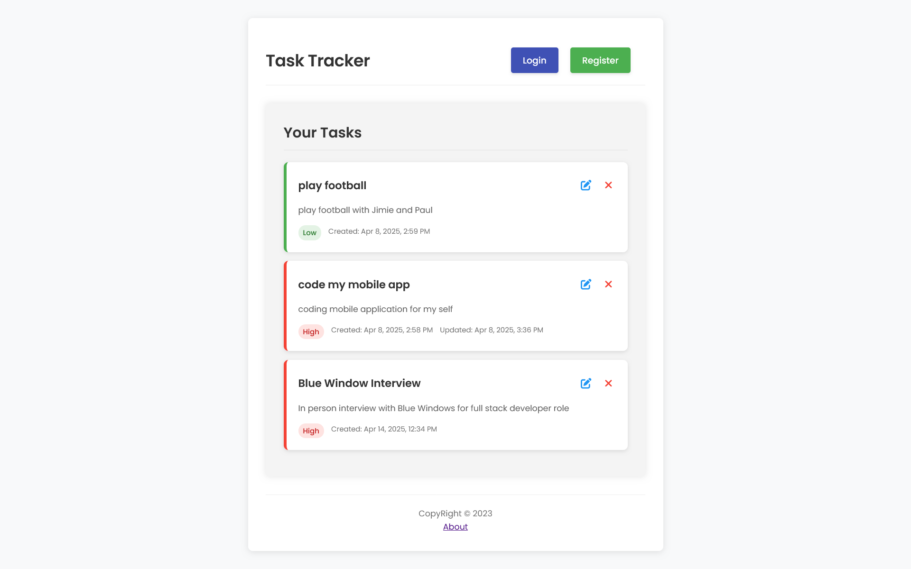
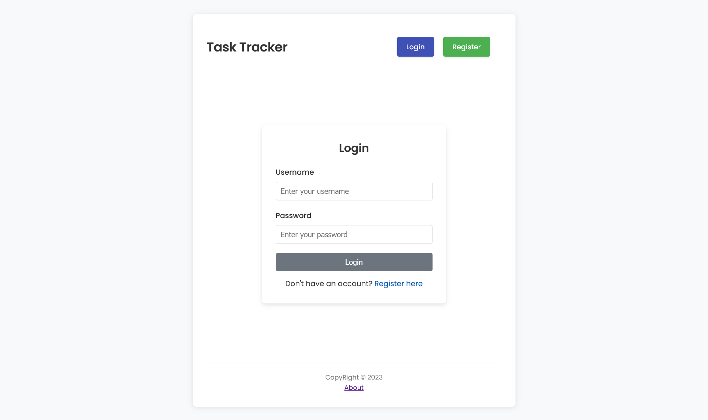

# BlueWindow Todo Fullstack Application

A full-stack todo application with authentication built with NestJS, TypeORM, PostgreSQL, and Angular.

[](https://bluewindow-todo-fullstack-production.up.railway.app)



## Features

- User authentication with JWT
- CRUD operations for tasks
- Task prioritization
- Responsive UI
- Containerized development and deployment using Docker

## Technology Stack

### Backend
- NestJS framework
- TypeORM for database operations
- PostgreSQL database
- JWT authentication
- Swagger API documentation

### Frontend
- Angular 16+ with standalone components
- Angular Router for navigation
- Reactive forms for data input
- HTTP Interceptors for JWT handling

### DevOps
- Docker & Docker Compose for containerization
- Multi-stage Docker builds for optimized images

## Getting Started

### Prerequisites
- Docker and Docker Compose
- Node.js (for local development)
- npm (Node Package Manager)

### Setup

1. Clone the repository:
```bash
git clone https://github.com/JospenWolongwo/bluewindow-todo-fullstack.git
cd bluewindow-todo-fullstack
```

2. Create environment files:
```bash
cp .env.example .env
```

3. Start the application with Docker:

**Production mode:**
```bash
docker-compose up
```

**Development mode (with hot-reloading):**
```bash
docker-compose -f docker-compose.yml -f docker-compose.override.yml up
```

4. Access the application:
- Frontend: http://localhost:4200
- Backend API: http://localhost:3001/api
- API Documentation: http://localhost:3001/api/docs
- PgAdmin: http://localhost:5050 (credentials in .env)

### Local Development (without Docker)

#### Backend
```bash
cd backend
npm install
npm run start:dev
```

#### Frontend
```bash
cd frontend
npm install
ng serve
```

## Project Structure

```
bluewindow-todo-fullstack/
├── frontend/                # Angular frontend application
│   ├── src/
│   │   ├── app/
│   │   │   ├── components/  # Reusable components
│   │   │   ├── pages/       # Page components
│   │   │   ├── services/    # API services
│   │   │   └── ...
│   │   └── ...
│   ├── Dockerfile           # Frontend Docker configuration
│   └── ...
├── backend/                 # NestJS backend application
│   ├── src/
│   │   ├── auth/            # Authentication module
│   │   ├── tasks/           # Tasks module
│   │   ├── common/          # Shared utilities
│   │   └── ...
│   ├── Dockerfile           # Backend Docker configuration
│   └── ...
├── docker-compose.yml       # Docker Compose configuration
├── docker-compose.override.yml # Development overrides
└── ...
```

## Environment Variables

See `.env.example` for required environment variables.

## Screenshots

### Tasks Management Page


### Login Page



## Contributing

1. Fork the repository
2. Create your feature branch (`git checkout -b feature/amazing-feature`)
3. Commit your changes (`git commit -m 'Add some amazing feature'`)
4. Push to the branch (`git push origin feature/amazing-feature`)
5. Open a Pull Request

## Contact

- **Developer**: Jospen Wolongwo
- **Email**: [jospenwolongwo@gmail.com](mailto:jospenwolongwo@gmail.com)
- **Website**: [jospenwolongwo.com](https://jospenwolongwo.com)
- **GitHub**: [JospenWolongwo](https://github.com/JospenWolongwo)